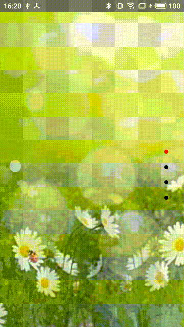
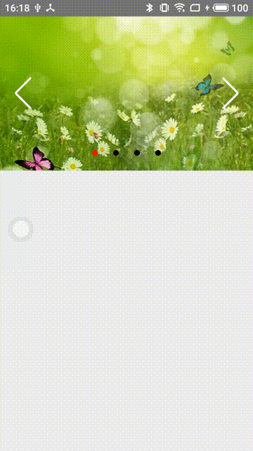

<!--
 * @Author: 1016112504@qq.com
 * @Date: 2019-11-08 16:25:23
 * @LastEditTime: 2019-11-08 18:55:20
 * @LastEditors: Please set LastEditors
 * @Description: In User Settings Edit
 * @FilePath: \react_native_appc:\Users\123\Desktop\react_native_swiper\README.md
 -->
# 轮播图

# 参数
| 属性 | 类型 | 默认值 | 描述 |                 
| --- | --- | --- | --- |
| width | PropTypes.number.isRequired |  | 宽度 |
| height | PropTypes.number.isRequired |  | 高度 |
| dataSource | PropTypes.array.isRequired |  | 轮播图渲染数组 |
| index | PropTypes.number | 0 | 轮播默认显示项 |
| offset | PropTypes.number | 0 | 左右或上下偏移量 |
| horizontal | PropTypes.bool | true | 是否横向滚动 |
| isHighChange | PropTypes.bool | false | 轮播图的高是否一样 |
| loop | PropTypes.bool | false | 是否循环 |
| isShowPagination | PropTypes.bool | false | 是否显示分页器 |
| paginationItemStyle | PropTypes.object | {} | 分页器样式、圆点大小，圆角大小等 |
| activeTintColor | PropTypes.string | 'red' | 分页器激活颜色 |
| inactiveTintColor | PropTypes.string | '#000' | 分页器默认颜色 |
| isShowNavigationButtons | PropTypes.bool | false | 是否显示前进后退按钮 |
| SwiperButtonNext | PropTypes.func | null | 前进按钮渲染 |
| SwiperButtonPrev | PropTypes.func | null | 后退按钮渲染 |
| SwiperButtonIconColor | PropTypes.string | '#000' |前进后退按钮的图标颜色 |
| autoplayTimeout | PropTypes.number | 2 | 自动轮播时间，单位是秒 |
| autoplayDirection | PropTypes.bool | true | true代表朝着卡片索引大的方向 |
| ratio | PropTypes.number | 1 | 轮播卡片缩放，默认不缩放 |
| renderRow | PropTypes.func.isRequired | | 轮播卡片渲染|
| onPress | PropTypes.func | | 轮播卡片点击事件 |
| onWillChange | PropTypes.func | | 轮播某卡片将要显示 | 
| onDidChange | PropTypes.func | | 轮播某卡片已显示 |

# 方法
| 方法 | 描述 |                    
| --- | --- | 
| scrollTo(index, animated = true) | 滚动到指定位置 |

# 使用

引入组件：

```js
import Swiper from '组件地址';
```

使用组件：

```js
<Swiper style={{}}
    dataSource={data}
    width={ width }
    height={400 }
    renderRow={this.renderRow.bind(this)}
    onPress={this.onPressRow} 
    ratio={0.8} 
    loop={false}
    autoplay={false}
    ref={ref=>this.Swiper=ref}
    isHighChange={true}
    isShowPagination={false}
    paginationItemStyle={{}}
    isShowNavigationButtons={false}
    SwiperButtonIconColor='#fff'
    onDidChange={(obj,index)=>{
        
    }}
    onWillChange={(obj,index)=>{
        
    }}
    //horizontal={false}
    //activeTintColor='red'//分页器激活背景色
    //inactiveTintColor='yellow'//分页器默认背景色
    //SwiperButtonNext={this._SwiperButtonNext.bind(this)}//前进按钮渲染
    //SwiperButtonPrev={this._SwiperButtonPrev.bind(this)}//后退按钮渲染
    
/>
```


# 效果图



